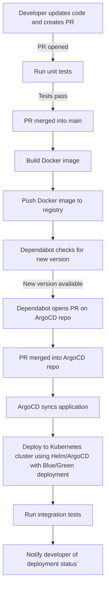

# DevOps - Create Pipeline for Sample Application# DevOps - Create Pi

> This sample application was forked from: [dev.azure.com/devopstbz](https://dev.azure.com/devopstbz/_git/FLASKBLOG)

The goal of this setup is to create an end-to-end DevOps pipeline for this sample application using GitHub Actions and ArgoCD.

## Architecture

The setup relies on a Kubernetes cluster running k0s, hosted on the on-premise MaaS-Cloud of the school. On this Kubernetes cluster, the GitHub ARC-Controller and ARC-Runner-Scale-Set are installed.

## GitHub Self-Hosted ARC-Runner

The GitHub selfhosted ARC runner is instelled on two kubernetes namespaces. One component is the Arc-Controller, which will cordiante the pipeline jobs and talk to gh. The second part is a kuberetes scale set which will be used for scalling and running the github actions pipeline jobs

The installation of this setup is beeing documentetd here:

- [GitHub - Docs Selfhosted sctions runner controller](https://docs.github.com/en/actions/hosting-your-own-runners/managing-self-hosted-runners-with-actions-runner-controller/quickstart-for-actions-runner-controller)
- [Youtube - In dept how2](https://www.youtube.com/watch?v=_F5ocPrv6io)

## Pipeline Process

The following diagram illustrates the workflow of the pipeline:

